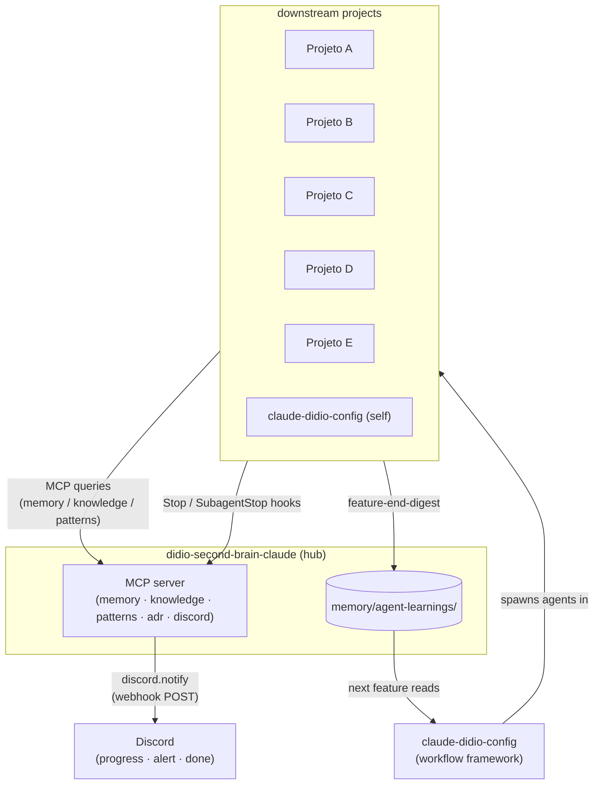

# didio-second-brain — clean starter

> A ready-to-use second brain hub for Claude Code projects, powered by the [`claude-didio-config`](https://github.com/eduardodidio/claude-didio-config) framework.

This starter gives you a **centralized MCP server** that feeds all your Claude projects with shared memory, domain knowledge, reusable patterns, and Discord observability — out of the box.

## What's included

| Component | Description |
| --------- | ----------- |
| `mcp-server/` | TypeScript + Bun MCP server with 11 tools (`memory.*`, `knowledge.*`, `patterns.*`, `adr.*`, `discord.notify`) |
| `memory/agent-learnings/` | 4 role files (architect, developer, techlead, qa) pre-seeded with lessons from building this framework |
| `patterns/hooks/` | 6 battle-tested Claude Code hooks (session summary, progress, rate-limit alert, idle alert, error capture, feature-end digest) |
| `sync/` | Idempotent scripts to install the MCP + hooks into downstream projects |
| `agents/` | 4-agent Waves workflow prompts (architect, developer, techlead, qa) |
| `.claude/commands/` | Slash commands: `/didio`, `/create-feature`, `/plan-feature`, `/dashboard`, `/check-readiness`, `/elicit-prd` |
| `knowledge/` | Empty domain knowledge directories — add your own |
| `projects/registry.yaml` | Empty project registry — add your downstream projects |

## Installation

Follow these steps to set up your second-brain hub and connect it to your Claude Code projects.

## Prerequisites

- [Claude Code](https://claude.ai/code) installed
- [Bun](https://bun.sh) installed (`curl -fsSL https://bun.sh/install | bash`)
- [`claude-didio-config`](https://github.com/eduardodidio/claude-didio-config) installed (`npm i -g claude-didio-config` or see repo instructions)

## Quick start

```bash
# 1. Clone this repo
git clone https://github.com/eduardodidio/didio-second-brain-clean-starter.git my-second-brain
cd my-second-brain

# 2. Install MCP server dependencies
cd mcp-server && bun install && cd ..

# 3. Configure environment (Discord webhooks, MCP path)
cp .env.example .env
# Edit .env with your values

# 4. Register your projects
# Edit projects/registry.yaml — add the downstream projects that will use this hub

# 5. Install the MCP in a downstream project
bash sync/install-mcp-in-project.sh /path/to/your/project

# 6. Start the MCP server
cd mcp-server && bun run dev
```

## Using the framework

Open any project in Claude Code and use the slash commands:

```
/didio              → interactive menu (all operations)
/create-feature F01 "description"   → full 4-agent pipeline
/plan-feature F01 "description"     → architect only (no execution)
/dashboard          → open monitoring dashboard at localhost:7777
```

## Synergy with claude-didio-config

The didio ecosystem is split into two complementary layers:

**`claude-didio-config`** is the **workflow engine**: it defines the 4-agent pipeline
(Architect → Developer → TechLead → QA), the slash commands (`/create-feature`,
`/plan-feature`, `/didio`), the orchestrator, and the dashboard. It is generic —
any project can adopt it independently.

**`didio-second-brain-claude`** (this repo) is the **knowledge layer**: it exposes
an MCP server with the tools `memory.*`, `knowledge.*`, `patterns.*`, `adr.*`, and
`discord.notify`. It stores cross-project agent-learnings, canonical ADRs, and
Discord hooks. It is opinionated — it carries the domain of the 6 didio projects
and curated content for that specific ecosystem.

Why two repos? The framework is reusable by any team; the second-brain is specific
to the didio ecosystem. You can run `claude-didio-config` without this hub — the
4-agent pipeline works, but you lose cross-project memory, shared ADRs, and Discord
notifications. Combined, the agents in each project remember what they learned
across all the others.

## Architecture overview

Live diagram — source: `docs/diagrams/F18-orchestration-overview.mmd`.



## Project structure

```
.
├── CLAUDE.md                    framework instructions for Claude
├── .env.example                 required env vars template
├── mcp-server/                  TypeScript MCP server (bun run dev)
├── memory/
│   └── agent-learnings/         per-role lessons (architect/developer/techlead/qa)
├── knowledge/                   domain knowledge indexed by area (add yours)
├── patterns/
│   ├── hooks/                   6 Claude Code hooks ready to install
│   ├── agents/                  agent pattern reference docs
│   └── snippets/                reusable code snippets
├── projects/
│   └── registry.yaml            list of downstream projects consuming this hub
├── sync/                        install scripts for downstream projects
├── integrations/discord/        webhook templates and README
├── docs/
│   ├── adr/                     Architecture Decision Records (0000-template + ADR-0001)
│   ├── prd/                     PRD template
│   └── diagrams/                Mermaid diagram templates
├── tasks/features/              per-feature task manifests (FXX-template included)
├── agents/                      workflow prompts and orchestrator docs
└── _bootstrap/scripts/          heartbeat, lint-vault, token-report scripts
```

## Customization

1. **Add domain knowledge** — drop `.md` files under `knowledge/<area>/` with frontmatter `type: knowledge`, `domain: <area>`, `status: active`
2. **Add projects** — edit `projects/registry.yaml` and run `bash sync/install-mcp-in-project.sh <path>`
3. **Install Discord hooks** — run `bash sync/install-discord-hooks.sh` after setting `DISCORD_*` vars in `.env`
4. **Install feature-end digest** — run `bash sync/install-feature-end-digest-hook.sh <project-path>` to auto-collect learnings when features close

## Running tests

```bash
cd mcp-server && bun test
bash sync/tests/run-all.sh
```

## Credits

Built on top of [`claude-didio-config`](https://github.com/eduardodidio/claude-didio-config) by Eduardo Didio.
Conceptually inspired by [`second-brain-starter`](https://github.com/marciohideaki/second-brain-starter) by **Marcio Hideaki** (MIT) — a great professional who goes far beyond technical inspiration, dedicated to teaching and a strong advocate for Artificial Intelligence. Thank you so much, Maebara :)
